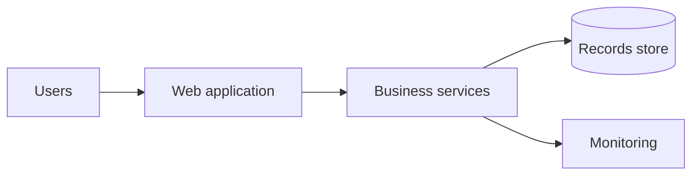

# Plain-language architecture reference

Use with `simplify-architecture` when rewriting markdown.

---

## Output template

Copy this structure; omit sections with no content; do not leave placeholder tokens in the final file.

```markdown
# [System name] — Architecture overview

*Audience: non-technical stakeholders. Last updated: [date if known].*

## What this system does

[2–4 sentences: business outcome, who benefits, what would break if it were unavailable.]

## Who uses it

| Audience | How they use it |
|----------|-----------------|
| [e.g. field staff] | [plain description] |
| [e.g. other systems] | [high-level integration] |

## High-level picture

[Optional: single mermaid diagram — see Diagram rules]

## Main parts of the system

| Part | Role in plain language |
|------|-------------------------|
| [Name] | [One sentence, no framework names] |

## How information flows

1. [Step in business language]
2. […]
3. […]

Keep to **5 steps or fewer**. Merge technical substeps.

## Connections to other systems

- **[External system]** — [why we connect; what data category moves, not schema]

## Security, privacy, and reliability (summary)

- **Security**: [authentication/authorisation in plain terms, or "standard organisation controls"]
- **Privacy**: [what personal or sensitive data is involved, if any]
- **Reliability**: [backup, redundancy, or maintenance windows in plain terms]

## What this document does not cover

Implementation detail, APIs, and deployment procedures are documented separately for engineering teams.

## Further reading

- [Link to original technical doc, if applicable]
```

---

## Simplification rules

### Remove or rewrite

| Technical | Plain-language approach |
|-----------|-------------------------|
| Class, namespace, file path | Capability or service name |
| Framework (ASP.NET, React) | "Web application" / "user interface" unless brand matters |
| Database product + version | "Managed database" / "records store" |
| REST, gRPC, GraphQL | "Requests data over the network" / "API" once, defined |
| Kubernetes, Docker, App Service | "Hosted in the cloud" / "container platform" |
| CI/CD pipeline names | "Automated build and release process" |
| Metrics (Prometheus, OTel) | "Monitoring and alerting" |

### Keep (when relevant to trust or compliance)

- Named **external** organisations or regulators if in source
- **Geographic** hosting (e.g. Australia East) if policy-relevant
- **Legacy** system involvement if migration risk matters to stakeholders

### Never do

- Invent features, SLAs, or certifications not in source material
- Claim "secure" or "compliant" without the source stating how
- Use sarcasm, idioms, or culture-specific jokes
- Bury warnings in footnotes—call out legacy or single-point-of-failure plainly

---

## C4 mapping (high level only)

| C4 level | In simplified doc |
|----------|-------------------|
| **Context** | "What this system does", "Who uses it", external systems |
| **Container** | "Main parts", simple diagram boxes |
| **Component** | **Omit** — link to technical docs instead |
| **Code** | **Omit** |

---

## Diagram rules

**When to include:** multiple containers and non-obvious data flow.

**When to skip:** single monolith with one database; diagram would duplicate the table.

Example (adjust labels to project):



Rules:

- ≤ 7 nodes
- No hex IDs, ports, or protocol names on arrows
- Use `flowchart` not `sequenceDiagram` unless user needs a time story (rare)

---

## Vocabulary (preferred plain terms)

| Instead of | Prefer |
|------------|--------|
| deploy | release / put live |
| instance | copy / running environment |
| payload | data sent |
| endpoint | access point / service entry |
| schema | structure of stored information |
| authenticate | verify identity / sign in |
| authorise | check permission |
| latency | response time |
| shard / partition | split storage (explain only if unavoidable) |

---

## Side-by-side appendix (optional)

When mode is **side-by-side**, append:

```markdown
---

## Technical mapping (for reviewers)

| Simplified term | Source reference |
|-----------------|------------------|
| [Business services] | [Original heading or file, no code] |
```

Do not paste large code or config blocks into this appendix.

---

## Quality checklist

- [ ] Readable in under 5 minutes
- [ ] No unexplained acronyms (or a single glossary line)
- [ ] Headings tell a story: what → who → parts → flow → risks → links
- [ ] Same facts as source; fewer words, not different meaning
- [ ] "Further reading" points to authoritative technical docs when they exist
